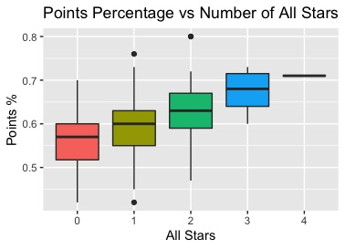
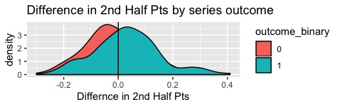
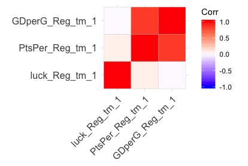
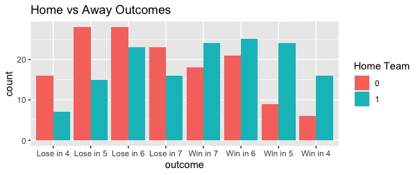
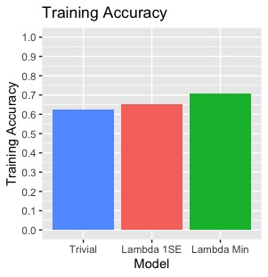
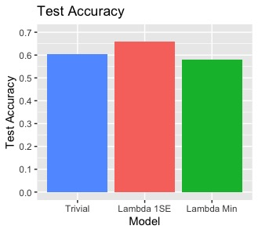
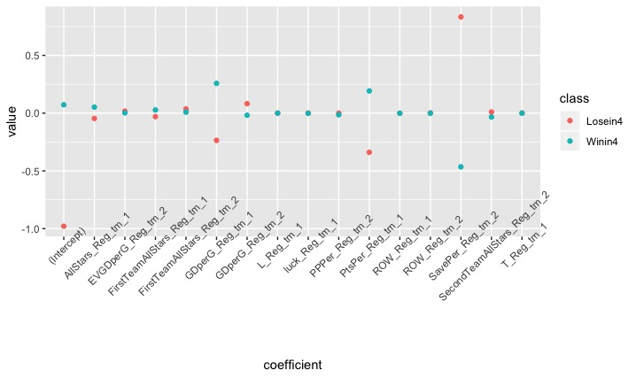

```{r setup, include=FALSE}
knitr::opts_chunk$set(echo = TRUE)
```

```{r, echo=FALSE, message=FALSE}
# set seed
set.seed(1992)
# load packages
library(tidyverse)
library(modelr)
library(glmnet)
```


# Introduction

### Overview

The National Hockey League (NHL) is the highest level of hockey played in the world, and the league is notorious for exciting and random playoff matches (series). This report attempts to build a prediciton model to predict the outcome of these playoff series, and ultimately the Stanley Cup (playoff) Champion, using regular season data.  I first explore the motivation for the hypothesis of the role luck (randonmess) plays in playoff series.  Then, I explore the which variables could help predict playoff outcomes.  The model used for prediction is a multinomial, ordinal logistic regression model utlizing LASSO techniques for variable selection. This model is compared with a trivial model that always predicts the better regular season team (more points) to win each series.  Luck's role in playoff outcomes is revisted and assessed.  

### Background

Here I will provide some background for those who are not as familiar with hockey and the NHL. Hockey is a sport played with 2 teams, each with 5 skaters and a goalie, on ice with sticks and a puck. The goal is to use your stick to hit the puck into the opposing team's net at the end of the ice rink. The NHL has, now, 31 teams split into 4 conferences with 2 divisions each (4 total divisions). The NHL is played in seasons, with one season running from October to June of each year. In the regular season, each team plays other teams in the league to accumulate points.  Points determine which teams make the playoffs, with wins counting as 2 points, and Ties and Overtime-Losses as 1 point. 16 of 31 teams in the NHL make the playoffs, and teams who performed better during the regular season earn a higher 'seed', and are matched up with teams who played worse during the regular season and earned a lower 'seed'. Teams play a best-of-7 games series against another team before advancing to the next round. If you lose a series, you are elimnated from the playoffs and must prepare for next season. The goal is to continue to win rounds until every other team is eliminated. The winning team is crowned the Stanley Cup Champion for that season, the ultimate prize. 

### Motivation

The Stanley Cups Playoffs, the name of the NHL’s playoff championship, has a reputation for excitement and close matchups.  I find that NBC Sports’ marketing campaign sums up the reputation well: “There’s nothing like playoff hockey” (SOURCE 1).  In 2018-19, the Tampa Bay Lightning put together one of the best regular seasons in NHL history, accumulating the most points for a team in an NHL season since the 1995-96 season, and the fourth most points ever (SOURCE 2). They dominated most teams and were a consensus favorite to win the Stanley Cup Playoffs that year.  However, in the first round of the playoffs they faced The Columbus Blue Jackets, a newer team to the league that had never won a playoff series before in its history. In what would seem the most unlikely of outcomes, The Blue Jackets won the series by winning 4 games in a row (called a sweep). How could one of the best teams in NHL history lose a best-of-7 game series without winning 1 game?  While the Lightning are likely an outlier, all four division winners were upset by a lower ranked team and lost their respective first rounds series (FIGURE 1). Many will chalk up these upsets to the lore of "puck luck", and the excitement of playoff hockey. However, they may have been reasons these teams lost these series that most didn't see in the standings. 


### Questions and Goals

###### Questions
* Can we try to predict which teams will perform successfully in the playoffs?
* Are there hidden regular season predictors of playoff success?
* How much of a role does "puck luck" truly play in playoff hockey?
* How much "puck luck" can we explain-away with a prediction model?
* Can we incorporate the 'closeness' of a playoff series' outcome in our prediction model?

###### Goals
* Build a prediction model to predict playoff series winners
* Compare this model to a trivial model predicting the better team to win
* Reflect on the nature of randomness in hockey


# Approach

### Data Preperation

The dataset was found on the website [Kaggle](https://www.kaggle.com/open-source-sports/professional-hockey-database).  It contains a collection of historical statistics from men’s professional hockey leagues, from 1909 – 2011.  It includes files containing data on teams, players, goalies, playoff series matchups, and other useful information.  All of the data is season-level.  This means that, for example, it contained for each team the total goals scored over the course of the season.  This data is summarized one step, compared to game-level data that contains information on the outcome of each individual game over the season.  The most accurate form of data in hockey is event and puck level data, which the NHL began to record only this year in 2019.  In each level of summary that occurs (summarizing over each period, then each game, then over the season), more information and nuance is lost in the data.  Therefore, a major limitation of this research is the use of season-level data instead of game-level or event-level data.  Season-level data’s benefit is in its ease of use for researchers and viewers.

While the dataset contained data from 1909-2011, I chose to only utilize data from 1986-2011.    The early years of the NHL were a very different from the game played today, with as few as 6 teams playing in the league at one point.  Our model will be predicting the outcome of playoff matches, so we wanted to look at NHL seasons with a consistent playoff format.  The 1986 season in the data was the first season where each round was a best-of-7 series.  

### Methodology

Before predicting which teams would be successful in the playoffs, we had to determine what exactly it was that we wanted to predict.  It became clear that instead of looking at each team individually and how many rounds they won in the playoffs, it would be more accurate to look at each series.  There we could analyze the differences between a team and its specific opponent, and train a model based on the outcome of each series (team A wins, team B loses).  The model would use regular season statistics to determine our dependent variable, outcome (i.e. which team will likely win the series).

This method was consistent with most previous prediction models of the Stanley Cup Playoffs and other sports in various articles and research (SOURCE 5, SOURCE 6). Most authors proposed using logit regression, with 1 corresponding to winning the series and 0 to losing the series. The logit model constructs a probability score that the given independent data corresponds to each outcome (Ex: 0.6 would imply a prediction of a 60% chance of winning the series).  This is the most straightforward way to approach this prediction, but it presents one main problem.  Under logit regression, it classifies a series win in 4 games (winning 4, losing 0 games) as the same as a series win in 7 games (winning 4, losing 3 games).  While both are series wins, which is what we are trying to predict, it removes a significant amount of data.  With only a binary outcome variable, we cannot train the model to understand why a team won a very lopsided series (win in 4) versus a series that was virtually a “toss-up” between the two teams (win in 7).

To make sure that we accounted for the closeness of a playoff series in the training of our model, we elected to follow the approach of an article by [Phil Curry](http://www.depthockeyanalytics.com/uncategorized/the-methodology-behind-the-si-predictions/). The article proposes making the dependent outcome (of the series) variable an ordered factor (categorical variable). The possible outcomes for our outcome variable can be defined as:
$$outcome = \{lose in 4 < lose in 5 < lose in 6 < lose in 7 <  win in 7 < win in 6 < win in 5 < win in 4 \}$$
The less than symbols show that losing in 4 games (winning 0 games) is worse than losing in 5 games (winning 1 game), and so on.  The most common models to utilize for an ordered variable are the ordered logit and probit models, commonly summarized as multinomial models.  Similar to the logit model, the multinomial models construct a probability score that the belongs to each of the 8 outcome classes.  To determine the probability that a given team wins a series, we simply sum the probabilities for the 4 winning classes (SOURCE 4): 
$$\mathrm{P}(win) = \mathrm{P}(win in 7) + \mathrm{P}(win in 6) + \mathrm{P}(win in 5) + \mathrm{P}(win in 4) $$
To get a binary prediction of a win or loss for team A in a series (versus team B), we simply define a binary outcome prediction to be 1 if $\mathrm{P}(win) > 0.5$ and to be 0 if $\mathrm{P}(win) < 0.5$  To test our model, we can compare the true outcome of the series for team A (win or loss), with our binary outcome prediction variable to determine our prediction accuracy.  
$$Binary Outcome = \{0:loss, 1: win\} $$

### Framing

My goal for this project is to predict which teams will be successful in the playoffs. With that said, randomness, or luck as it is referred to in sports, will always play a role in sports games, in life, and especially in hockey. Many researchers have looked into the randomness of sports, and have found hockey is the luckiest sport of the major sports in America, espcially in the last 20 years (SOURCE 7). Now, the role of analytics in sports is to try to explain as much of this randomess as possible. "All models are wrong, but some are useful" - George E.P. Box.  The model developed in the following pages will be an attempt to be useful, not a perfect representation of reality. Luck's factor in a hockey series' outcome will be ever-present, and the accuracy of these models will reflect that luck. My intention is to explain only some of this luck, and provide a useful reference point in the prediction of winning hockey teams. 


# Analysis

### Overview

To successfully predict postseason success, we needed to gather all variables corresponding to a team’s regular season play. Data on each team’s players, goalies, and team statistics were in separate tables from the initial dataset. The intent was to hypothesize any relevant variable to team success, create those variables based on the respective tables, and combine the information into one table labeled series.  This series table would contain a number of variables for 2 teams, with team A playing against team B for the series. The outcome variable in our model would be based on team A’s outcome. 

Since the model will be based on prediction, partitioning the dataset is key prinicple to follow. Partitioning the dataset allowsus to use the same dataset for both confirmatory and exploratory analysis. The training set (80% of the data in our case) is for visualization, fitting, and tuning models. The testing set is for testing the prediction accuracy of the final model on 'unseen' data. This helps use avoid the problem of overfitting the dataset. All visualizations for exploration in this report, unless named otherwise, are conducted with the training dataset.

### Players and Goalies Variables

The first table we will analyze will be the players data. The players data contained information on a number of statistics they accumulated over the course of the season.  Most of this information is not directly related to team success.  For example, both a bad and good team can have players that score a large number of goals. Many other research projects can be done to analyze player’s effectiveness in leading a team to victory, but we will not cover that here.  

Instead, the main variables of concern will be the season awards for players. Each season the NHL awards an MVP (Hart trophy), 6 first-team All-Stars, and 6 second-team All-Stars.  These awards are given to the best players in their respective positions that season. Intuition conclude that teams with the best players are likely to win more games, and maybe more crucial games such as in the playoffs. From here we calculated the number of these awards given to players who played on each team during each season. In Figure 2, we can see a clear correlation between the number of All-Stars a team has and its ability to win games during the regular season. 



The goalies table only contained one piece of information relevant to team success, Save Percentage. Save Percentage is the easiest determinant of the quality of both a team's goaltender and their defense.  

### Team Data

For the team data, a number of vraiables were created from the data provided. Most of these variables were linaer combinations of other variables ($GD = GF - GA$), or were tranformations of variables provided. The most common transformation was turning season long counts into 'per game' counts ($GFperG = \frac{GF}{G}$). Most of the seasons played in the NHL in the data analyzed were seasons of 80,82, or 84 games. However, the data also included a shortened season of 48 games due to a labor lockout. Since the number of games was inconsitent, using per game statistics would provide a way to standardize these variables. Another standarization was done for Points, using Points Percentage. $PtsPer = \frac{Points}{Possible Points}$, where $Points Possible = 2 * Games$, indicating that a team won every game they played (gathering the most points possible). Points Percentage is commonly used in the hockey analytics communitty, in favor over points per game. Points Percentage will be used extensively as it is the main determinant of the success of a team. 

A few variables were added due to the findings of other research (SOURCE 4). These included Points in the last month, Points in the second half of the season, team with home ice in the series, and a 'luck' variable. 

Points in the second half of the season was a variable in particular I wanted to explore. Many teams trade players with other teams to try to improve their team, and can become a very strong team as a result. This increase in their strength as a team may not be reflected in the total Points they accumulated over the course of the season, but may be visible in the Points they acquired during the second half of the season. Second Half Points on their own did not show much correlation or promise, but when you calculate the difference in Second Half Points between team A and team B, you begin to see the influence. Figure 3 shows this when you group by the binary outcome of the series (1: win, 0: loss) for team A. A positive differnce implies team A acquired a greater percentage of the possible points durin ghte second half of the season. The difference in the density of the two outcomes is not stark, but warrants inclusion in our models.



The luck variable was another interesting inclusion. 'Puck Luck' can manifest itself in many ways, but one way in particular is in the outcome of one goal games (SOURCE 4). One goal games are very close, and could sway the number of Points a team acquires over a season if they happen to have 'luck' on their side. Since the data was season-level, as opposed to game-level data, we could not analyze all one goal games, but we could look at how teams fared in shootouts. Shootouts were only introduced to the NHL in the 2005 season, but they occured after 2 teams were tied after an overtime period was played. This allowed the winner of the shootout to gain 2 Points for winning, and the loser to only gain 1 Point, even though the teams were evenly matched. How a team competes in shootouts may not correlated with regular gameplay, and it may be possible that their Points accumlated over the season are biased with the amount of 'luck' they had in these shootouts. We defined $luck = SoW - SoL$, where SoW is shootout wins. To test our luck variable's influence, we looked at the correlation between luck and two other variables, Points Percentage and Goal Differential per game. We chose these because they are highly correlated with one another, and are both similarly positively correlated with the binary outcome of a series (more on this later, Figure 5). As we can see in Figure 4, our hypothesis was correct. luck is positively correlated with Points Percentage, since more luck leads to more points. However, luck is barely correlated, slightly negatively, with Goal Differential since the two are not related. This shows luck may have a role to play in our models. The caveat is that correlations are very weak, since our luck variable does not contain much information and is only relevant for seasons 2005-2011, while our data goes back to 1987. 



### Exploratory Analysis

At this point, all relevant variables have been created for both team A and team B and formed into one table, prepared for modeling. Before beginning the modeling process, I wanted to explore the relationships between some of the key variables. To hypothesize which predictors would be most relevant in our modeling, I computed the correlations between the binary outcome variable and the predictors. I found that correlations between the binary outcome and other variables were very small, with only a handful greater than 0.2, or less than -0.2 for negatively correlated variables. Figure 5 contains the positively correlated variables with greater than 0.2 correlation with the binary outcome. As we can see, the 4 variables are highly correlated with each other, but only slightly with the outcome. This is very much in-line with our hypothesis that randomess and luck are a large part of hockey. 


Home-field advantage is seen as a major advantage in sports. Is the same true for playoff hockey? In an NHL playoff series, the first 2 games are played at the 'home' team, then rotating to the 'away' team's location for the team. In all, the location of the games for the home team are as such {Home,H,Away,A,H,A,H}. This is seen as a major advance, since if the series needs a seventh game, the game will be played at home for one team, and will likely be favored. I decided to plot the outcome of series for teams that started at home, and those that started away (Figure 6). Teams that started the series at home accumlated more series wins and stronger wins, than teams that started away. In particular, home teams had a major advantage in series that went to 7 games (lose in 7, win in 7). They often won the 7th game, possibly due to the home-field advantage. However, it must be noted that the teams who start at home are often stronger teams who accumulated more Points over the season. 



### glmnet Package

The glmnet package for R that fits a generalized linear model via penalized maximum likelihood (SOURCE 8). The glmnet package’s methods provide a few benefits over the base R glm function for this problem.  First, it is fully capable of computing multinomial models, and provides many built-in options to optimize, tune the model, and perform cross validation. The simplicity and accompanying vignette for glmnet allows for an easy use and understanding of the results. 

The main benefit is in variable selection. The algorithm utilizes LASSO techniques to select which variables should be included in the final model. The LASSO penalty tends to pick one of a number of correlated predictors and discard the others (SOURCE 8). The strength of this penalty is determined by the parameter $\lambda$, which is the main parameter to optimize. The package provides a range of $\lambda$ values for the model fit. The optimal value of $\lambda$ is the one corresponding to the minimum error measure of your choice. For multinomial models, glmnet allows for error measures of mean absolute error (mae), mean squared error (mse), deviance, and missclassification error. 

### Model Tuning 

The model tuning was straightforward. For each model we used cross validation to provide a more accurate training prediction value for model selection. Multinomial models were fit using the two error measures MAE and MSE. Missclassification error proved too volatile, as we were not as concerned as fitting each series in its true outcome. We were more interested in the distinction between wins and losses. 

For the two models using MAE and MSE, we pick the optimal $\lambda$ that minimzed the error. For the MSE minimized model, the $\lambda$ corresponding to minimzed MSE proved to always be a model with minimal variables (either 1 or 2) in each run. The prediction accuracy for these models were poor, so we moved forward with the MAE models. 

The choice of $\lambda$ determines the model penalty, which determines the inclusion of varibles. A larger $\lambda$ leads to more variables excluded from the model. A small $\lambda$ choice will lead the model to overfit the training data, another problem to avoid. In our first models, we used 10 folds for cross validation, and found most $\lambda$ provided similar MAE, albeit with varying standard errors. We decided to increase the folds to 20, and found our results improved (Figure 7). Two values of $\lambda$ are marked with a dotted line in the figure, the optimal $\lambda$ minimizing MAE and the $\lambda$ correponding to the most regularized model (least # of variables) within 1 standard deviaiton of the optimal $\lambda$. We also ran models with increased folds of 60, but found no improvement. 


In the end for our model we chose to use the $\lambda.1SE$ value to use for our model. First, while the o $\lambda.min$ provided a lower MAE, it was not by a largely signifcant amount. The $\lambda.min$ model also had a larger standard error, which could lead to bad prediction accuracy. The large number of variables included in the model could also lead to overfitting issues. The $\lambda.1SE$ model should be able to avoid overfitting due to its flexibility; it only uses a portion of the available predictors. We then compared the training accuracy for the 2 values of $\lambda$ and the trivial model (Figure 8). $\lambda.min$ provided the highest binary outcome prediction accuracy of 70.6%, while the $\lambda.1SE$ prediciton accuracy was 65.2% and the trivial model was 62.5%. In the end, we decided to move forward with the $\lambda.1SE$ as the parameter for our model, due to the overfitting conerns of $\lambda.min$. For reference, we will perform testing accuracy on both the $\lambda.min$ and $\lambda.1SE$, but our first choice of methods was the $\lambda.1SE$ model.



# Results

Running the model of the testing data, we got promising results. Our model, based on the $\lambda.1SE$ parameter, performed better than the trivial model, and much better than the overfit $\lambda.min$ model (Figure 9). The $\lambda.1SE$ model had a binary outcome prediciton accuracy of 65.8%, which about the same as its training accuracy. Wins and Losses were predicted about evenly by the model. Of course, a caveat is that the testing set was smaller, wiht only 76 observations. 



The model using parameter $\lambda.1SE$ succesfuly fit the data with only 16 variables. The 16 variables had coefficient values for each outcome (lose in 4, etc.), and the differnce for those values between the 2 most extreme outcomes is shown in Figure 10. These variables were the most relevant in prediction for the model.



# Conclusion

Overall, our model was able to perform slightly better than a trivial model, but the prediciton accuracy was not great overall (65.8%). This is likely due to the role of 'puck luck' in hockey. Our model was able to succesfully include the closeness of a series and form a starting point in analyzing the randomness of hockey. Our intial hypothesis was that we could only hope to improve slightly on the trivial model, due to the inherit randomness in the sport, and our model confirms this. 

### Limitations

The major limitation of this paper is the use of season-level data instead o game-level data. Game level data provides the researcher an ability to look into more predictors, such as how a team plays in close games, and against better or worse competition. Also, game-level data allows for the introduction of advanced hockey statistics, such as Corsi. Corsi has shown to be a greate predictor of success in hockey (Source 4). Further research and future iterations of this model should include game level data, more recently played seasons, and advanced statistics. 

### References

1. https://nbcsportsgrouppressbox.com/2019/04/03/final-draft-theres-nothing-like-playoff-hockey-nbc-sports-group-to-present-every-stanley-cup-playoff-game-for-eighth-consecutive-season/ 

2. https://records.nhl.com/records/team-records/standings-points/team-most-points-one-season 

3. https://www.cbssports.com/nhl/news/2019-nhl-playoffs-bracket-blues-win-first-stanley-cup-after-game-7-rout-of-bruins/ 

4. http://www.depthockeyanalytics.com/uncategorized/the-methodology-behind-the-si-predictions/ 

5. https://model284.com/nhl-playoff-model-methodology/ 

6.  https://www.researchgate.net/profile/Dohoon_Koo/publication/321237635_Logistic_Regression_of_Wins_and_Losses_in_Asia_League_Ice_Hockey_in_the_2014-2015_Season/links/5cbfe982a6fdcc1d49aa4198/Logistic-Regression-of-Wins-and-Losses-in-Asia-League-Ice-Hockey-in-the-2014-2015-Season.pdf 

7. https://torontosun.com/2016/04/14/hockey-is-luckiest-major-north-american-sport-researchers/wcm/4708121c-5c03-4265-b86d-8164c02bdb22 

8. https://web.stanford.edu/~hastie/glmnet/glmnet_alpha.html#log 
